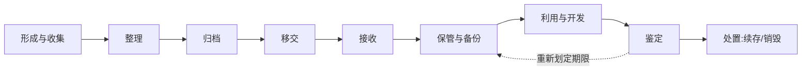

# 专题总览 02：档案工作全流程总览

## 一、档案全生命周期（主线图）

## 二、各环节核心要求汇总

### 1. 形成与收集
| 要点 | 出处 |
| --- | --- |
| 直接形成的具有保存价值的材料应归档；任何人不得拒绝归档或据为己有 | 档案法第 13、14 条 |
| 电子文件应来源可靠、程序规范、要素合规 | 档案法第 37 条 |
| 电子文件与元数据**一并收集归档** | 电子档案管理办法、GB/T 18894 |
| 同一业务活动文件应齐全完整；专有格式同时收集专用软件、技术资料 | GB/T 18894 7.1 |
| 声像文件客观系统反映主题；同场景多件挑最好的一件 | DA/T 78 |
| 政务服务办件：证照等共享数据一并采集 | GB/T 42727 |

### 2. 整理
| 要点 | 出处 |
| --- | --- |
| 以**件**为管理单位（可按卷）；分类方案保持一致 | GB/T 18894 |
| 科技档案：按项目、结构、阶段、台（套）组卷，文字在前图样在后 | GB/T 11822 |
| 照片：底片、照片分开存放；照片号两种格式 | GB/T 11821 |
| 声像：以件整理；按年度—保管期限或保管期限—年度分类 | DA/T 78 |
| 保管期限分档：永久 / 定期 30 年 / 定期 10 年（企业、科研、声像）；照片档案为永久/长期/短期 | 各规定 |

### 3. 归档
| 要点 | 出处 |
| --- | --- |
| 程序：**清点 → 鉴定 → 登记 → 填写归档登记表**；鉴定合格率 100% | GB/T 18894 8.1 |
| 文书归档最迟不超过形成后第 2 年 6 月 | GB/T 18894 |
| 电子公文：随办随归，最迟不超过整理完成后次年 6 月 | GB/T 39362 |
| 政务服务：办结后第 2 年 6 月前 | GB/T 42727 |
| 声像：形成起 **3 个月内**提交，最迟次年 6 月 | DA/T 78 |
| 电子印章处理：归档**去除数字签名，只保留印章图形** | 电子档案管理办法第 17、21 条 |

### 4. 移交与接收
| 要点 | 出处 |
| --- | --- |
| 移交期限：中央/省/设区市级接收范围**满 20 年**；县级接收范围**满 10 年** | 实施条例第 20 条 |
| 电子档案移交：四性检测合格；去除加密；附到期开放意见、政府信息公开情况、密级变更情况 | 电子档案管理办法第 21 条 |
| 声像电子档案自形成起 **5 年内**向同级国家综合档案馆移交 | DA/T 78 |
| 档案馆接收不得拒绝；接收时四性检测 | 档案法、电子档案管理办法 |
| 电子证照按版式电子文件形态归档 | GB/T 42727 |

### 5. 保管与备份
| 要点 | 出处 |
| --- | --- |
| 库房"八防" + 温湿度调控；新建库房满足未来 10 年存放 | 企业档案管理规定 |
| 电子档案备份：**磁/光/缩微介质选两种，三套数据（一套在线、两套备份）** | 电子档案管理办法第 26 条 |
| 异地备份：重要电子档案异地备份；介质定期检测 | 实施条例、电子档案管理办法 |
| 光盘 17～20℃/20%～50%；磁性载体 15～27℃/40%～60% | GB/T 18894、DA/T 78 |
| 磁性载体抽样检测率不低于 10%；光盘超三级预警线立即更新 | GB/T 18894 |
| 温湿度：照片彩色长期贮存 2℃/30%～40% | GB/T 11821 |

### 6. 利用与开发
| 要点 | 出处 |
| --- | --- |
| 档案形成之日起**满 25 年**向社会开放（经济教育科技文化可少于，涉国家安全可多于） | 档案法第 27 条 |
| 持合法证明利用开放档案；未开放档案需经保管单位同意 | 档案法、实施条例 |
| 复制件载有保管单位签章标识的与原件同等效力 | 实施条例第 32 条 |
| 电子档案离线存储介质**不得外借** | GB/T 18894 |
| 开发形式：编研（大事记、组织沿革、专题汇编）、展览、文创、专题数据库 | 各规定 |

### 7. 鉴定与处置
| 要点 | 出处 |
| --- | --- |
| 定期鉴定保管期满档案，形成鉴定报告；需续存的重划期限 | 实施条例第 24 条 |
| 销毁：编制销毁清册 → 鉴定委员会审批 → 监销 → 销毁清册永久保存 | 企业档案管理规定第 44 条 |
| 电子档案销毁：在线存储、容灾备份、离线介质**彻底删除**，元数据移入销毁数据库 | GB/T 18894、电子档案管理办法 |
| 转换迁移八步骤：确认需求→评估风险→制定方案→审批→测试→实施→评估→报告 | GB/T 18894 10.2 |

## 三、四个"四性"对比（高频）

| 文件 | 提法 |
| --- | --- |
| 档案法第 39 条 | 真实性、完整性、可用性、安全性（档案馆接收检测） |
| GB/T 18894 | 真实性、可靠性、完整性、可用性（鉴定） |
| 电子档案管理办法 | 真实性、完整性、可用性、安全性 |
| 软件功能清单 | 完整性、真实性、安全性、可用性（四性检测） |

> 记忆：GB/T 18894 用的是"**可靠性**"，其余多用"安全性"。

## 四、移交期限 vs 开放期限（易混数字）

| 期限 | 数值 |
| --- | --- |
| 县级档案馆接收范围的档案移交 | 满 10 年 |
| 中央/省/设区市级档案馆接收范围移交 | 满 20 年 |
| 档案向社会开放 | 满 25 年 |
| 电子公文/文书归档最迟 | 次年 6 月 |
| 声像电子档案移交进馆 | 形成起 5 年内 |

## 五、全流程记忆口诀

**收整理归移交接，保管利用鉴定销**；
**电子归档次年六，移交十年二十载**；
**开放二五牢记住，声像三月五年交**；
**四性检测贯穿走，元数据随文件走**。
