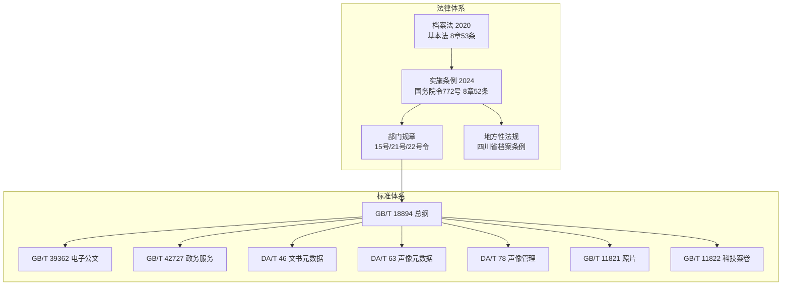
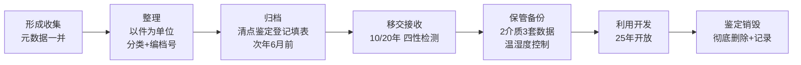
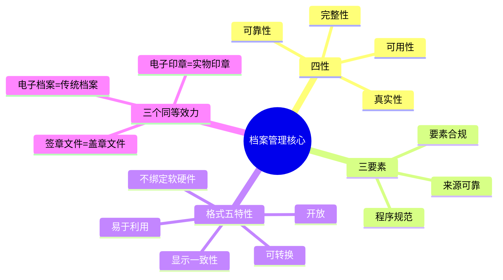

# 记忆辅助 04：一页总览图

## 一、档案管理体系总览

## 二、电子档案全生命周期

## 三、核心数字一页纸

| 类别  | 数字                     | 含义                             |
| --- | ---------------------- | ------------------------------ |
| 期限  | 10 / 20 / 25 年         | 县级移交 / 中央省级移交 / 开放             |
| 期限  | 3 个月 / 次年 6 月 / 5 年    | 声像提交归档 / 电子归档最迟 / 声像移交进馆       |
| 备份  | 2 种介质 / 3 套数据          | 磁光缩微选二；一套在线两套备份                |
| 格式  | 44.1kHz / 8Mbps        | 录音采样率 / 视频比特率                  |
| 温湿度 | 17～20℃ / 15～27℃        | 光盘 / 磁性载体（湿度 20～50% / 40～60%）  |
| 库房  | 5 / 12 kN/㎡            | 普通库房 / 密集架库房                   |
| 检查  | 10% / 6 个月 / 2 年 / 5 年 | 磁性抽检 / 监控保存 / 照片抽样 / 照片全面      |
| 元数据 | 88 / 96 / 32 元素        | DA/T 46 / DA/T 63 / GB/T 39362 |
| 必选  | 20 / 18 / 10 个         | DA/T 46 / DA/T 63 / GB/T 39362 |

## 四、四性 + 三要素 + 五特性

## 五、16 份文档一句话记忆

| 文档         | 一句话                               |
| ---------- | --------------------------------- |
| 档案法        | 基本法：统一领导分级管理，25 年开放，电子档案同等效力      |
| 实施条例       | 10/20 年移交、一二级出境、五类公布形式            |
| 企业档案管理规定   | 10/30 年期限、库房数字、一式三套离线备份           |
| 电子档案管理办法   | 三要素、两介质三套数据、去签名留印章                |
| 电子印章管理办法   | 谁所有谁控制谁签章谁负责、五跨互认                 |
| 科研档案规定     | 四阶段归档、六条件纯电子、牵头单位存一套              |
| GB/T 18894 | 总纲：四性、五特性、次年 6 月、8 步迁移            |
| GB/T 39362 | 公文 12 步、OFD 三层、M1～M32             |
| GB/T 42727 | 办件单位、容缺归档、A/B/C 元数据、D30/Y         |
| DA/T 46    | 文书元数据四域 88 元素                     |
| DA/T 63    | 声像元数据四实体 96 元素                    |
| GB/T 11821 | 照片：底片照片说明、F/K、温湿度                 |
| GB/T 11822 | 科技案卷：组卷原则、排列口诀、档号三要素              |
| DA/T 78    | 声像：44.1kHz/8Mbps、3 个月归档、Y/D30/D10 |
| 软件功能清单     | 六大子系统 + 智能家族 + 集成对接               |
| 四川省条例      | 地方特色：两库分类、红色档案、川字号                |
