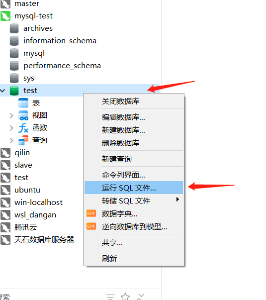

# Linux安装

## 1\.准备

### 1\.1 防火墙

1. 查看防火墙状态

2. 查看8080端口是否放开

3. 放开8080端口

4. 临时关闭防火墙（测试，重启服务器后会自动开启）

```Plain Text
systemctl status firewalld

# 会返回no或者yes
firewall-cmd --query-port=8080/tcp

# 永久放开8080端口
firewall-cmd --permanent --add-port=8080/tcp
firewall-cmd --reload #重新载入，验证一下是否成功放开
```

### 1\.2 白名单，通过设置防火墙白名单

暂不实施。

### 1\.3 软件挂载路径设置

提前设置好

```Plain Text
/docker/kkfile/config
/docker/minio/data
/docker/minio/config
/docker/redis/data
/docker/es/data
```

### 1\.4 jkd安装，配置

#### 1\.4\.1 解压

```Bash
tar -zxvf 
```

#### 1\.4\.2 配置

**vim /etc/profile\.d/java\.sh**

```Bash
**export JAVA_HOME=/usr/local/soft/java/jdk1.8.0_361**
**export CLASSPATH=.:${JAVA_HOME}/lib**
**export PATH=${JAVA_HOME}/bin:$PATH**
```

- 让修改立即生效

```Bash
source /etc/profile
```

- 查看Java版本，是否成功配置

```Bash
java -version
```


## 2\.docker 安装软件

### 2\.1 kkfile

```Plain Text
docker run -itd \
-p 8012:8012 \
--name kkfile \
-v /docker/kkfile/config/application.properties:/opt/kkFileView-4.1.0/config/application.properties \
kkfileview:latest
```

### 2\.2 minio

#### 2\.2\.1 创建命令

```Bash
docker run -p 9000:9000 -p 9001:9001 \
--name minio -d \
-e "MINIO_ROOT_USER=minioadmin" \
-e "MINIO_ROOT_PASSWORD=minioadmin" \
-v /docker/minio/data:/data \
-v /docker/minio/config:/root/.minio \
minio:latest server /data --console-address ":9001" --address ":9000"
```

#### 2\.2\.2 使用mc 创建data 桶，并且将桶设置为public

```Plain Text
开始设置

```

### 2\.3 ocr

```Plain Text
docker run -itd --name ppocr -p 8866:8868 ocr:x86_64
```

### 2\.4 redis

```Bash
docker run --name redis -p 6379:6379 -v /docker/redis/data:/data -d  redis:x86_64 redis-server /etc/redis/redis.conf --appendonly yes
```

### 2\.5 es

```Bash
docker run --name es -d -v /docker/es/data:/data \
-e "ES_JAVA_OPTS=-Xms512m -Xmx512m" \
-e "discovery.type=single-node" \
-p 9200:9200 -p 9300:9300 \
es:x86_64
```

### 2\.6 MySQL

#### 2\.6\.1 安装

```Bash
docker run --name mysql -e MYSQL_ROOT_PASSWORD=123456 -p 3306:3306 -d \
-v mysql_data:/var/lib/mysql \
mysql:x86_64 \
--lower-case-table-names=1 \
--character-set-server=utf8mb4 \
--collation-server=utf8mb4_0900_ai_ci
```

#### 2\.6\.2 连接数据库

- 使用navicat 连接数据库  

输入连接名称（自己命名）；输入对应的主机IP；端口号；用户名；密码；点击测试连接；测试通过就可以了。


- 创建数据库并导入数据

新建数据库


起名，字符集选择utf8。


- 导入数据  




选择对应的提供的sql 文件进行导入


导入成功后重新连接一下数据库，就可以看到数据库里面的内容了。


### 2\.7 ocrmypdf

```Plain Text
docker pull docker.1ms.run/jbarlow83/ocrmypdf:latest

或者解压
tar -zxvf ocrmypdf_x86_64.tar

# 运行
# 添加了 --privileged 参数，解决了无法创建线程的问题
docker run --rm -i --privileged ocrmypdf --force-ocr -l chi_sim - - < 1.pdf > output.pdf
```

### 2\.8 金仓数据库安装

#### 2\.8\.1 创建命令

```Plain Text
*docker run -tid --privileged \*
-p 4321:54321 \
-v /opt/kingbase/data:/home/kingbase/userdata/ \
--restart=always \
-e NEED_START=yes  \
-e DB_USER=kingbase  \
-e DB_PASSWORD=123456 \
-e DB_MODE=oracle  \
--name kingbase  \
kingbase:v1 /usr/sbin/init
```

#### 2\.8\.2  导入数据

1\.复制dump 文件到容器内部

```Plain Text
# 语法：docker cp 宿主机路径 容器名:容器内路径
docker cp /home/user/your_backup.dmp kingbase_container:/tmp/your_backup.dmp
```

2\.进入容器内部执行恢复命令

```Plain Text
docker exec -it kingbase bash

sys_restore -h 127.0.0.1 -p 54321 -U kingbase-d test -v /tmp/your_backup.dmp
```

- \-p 默认端口

- \-d 目标库名

- \-U 用户名

#### 2\.8\.3 金仓数据库使用


## 3\.部署

### 3\.1 部署

#### 3\.1\.1 启动tomcat

```Bash
**# 进入tomcat 安装目录下的 bin 目录**
cd /usr/local/soft/apache-tomcat-9.0.72/bin
**# 输入命令**
./start.sh

**# 查看 tomcat 运行状态**
ps -ef | grep tomcat

**#查看运行日志  进入目录**
/usr/local/soft/apache-tomcat-9.0.72/logs
**#运行命令,跟踪日志，**
tail -f catalina.out
```

##### 3\.1\.1\.1 将tomcat注册为服务并且设置为自启动


#### 3\.1\.2 上传打包好的文件到下面的目录

```Bash
这是两个打包好的包，
archives.war       dist

/usr/local/soft/apache-tomcat-9.0.72/webapps
```

会自动解析为archives文件夹

### 3\.2 修改配置文件

#### 3\.2\.1 application\-dev\.yml

文件路径:/usr/local/soft/apache\-tomcat\-9\.0\.72/webapps/archives/WEB\-INF/classes


1. 修改IP：端口/数据库

2. 修改数据库 username和password

```Bash
# 修改配置文件
**vim application-dev.yml**

# 192.168.182.133:3306/archives     对应的数据库IP和端口以及对应的数据库
url: jdbc:mysql://192.168.182.133:3306/archives?

```

#### 3\.2\.2 application\.yml

todo

#### 3\.2\.3 index\.js

文件路径：/usr/local/soft/apache\-tomcat\-9\.0\.72/webapps/ROOT/config

批量修改：%s/192\\\.168\\\.1\\\.12/192\\\.168\\\.182\\\.135/g


将IP改为本机IP，我是在虚拟机上，我把他们修改为虚拟机的IP地址。

%s/139\\\.155\\\.20\\\.25/192\\\.168\\\.1\\\.40/g


## ４\.访问

archives 中是后端代码

ROOT 中前端代码

代码的位置：/usr/local/soft/apache\-tomcat\-9\.0\.72/webapps

前端代码文件夹重命名为 ROOT

**访问地址：**192\.168\.182\.134:8080


## 5\.compose 

### 5\.1 安装docker compose

```Bash
# 1. 确认文件在当前目录
[wxq@192 docker]$ ls -lh
-rw-r--r-- 1 wxq wxq 31M Jun 23 10:00 docker-compose-linux-x86_64

# 2. 移动并重命名
[wxq@192 docker]$ sudo mv docker-compose-linux-x86_64 /usr/local/bin/docker-compose

# 3. 赋予执行权限
[wxq@192 docker]$ sudo chmod +x /usr/local/bin/docker-compose

# 4. 验证
[wxq@192 docker]$ docker-compose --version
Docker Compose version v2.23.0

# 5. 启动您的服务（确保 docker-compose.yml 在当前目录）
[wxq@192 docker]$ docker-compose up -d
```

### 5\.2 docker\-compose\.yml

- 记得把kkfile的配置文件放到 /docker/kkfile/config  目录下

```YAML
version: '3.8'

services:
  # ========== MySQL ==========
  mysql:
    image: mysql:x86_64
    container_name: mysql
    restart: unless-stopped
    environment:
      MYSQL_ROOT_PASSWORD: "123456"
    ports:
      - "3306:3306"
    volumes:
      - mysql_data:/var/lib/mysql
    command: --lower-case-table-names=1 --character-set-server=utf8mb4 --collation-server=utf8mb4_0900_ai_ci
    healthcheck:
      test: ["CMD", "mysqladmin", "ping", "-h", "localhost", "-u", "root", "-p$$MYSQL_ROOT_PASSWORD"]
      interval: 10s
      timeout: 5s
      retries: 5
      start_period: 30s

  # ========== Redis ==========
  redis:
    image: redis:x86_64
    container_name: redis
    restart: unless-stopped
    ports:
      - "6379:6379"
    volumes:
      - /docker/redis/data:/data
      # - /data/redis/redis.conf:/etc/redis/redis.conf   # 如需要
    command: redis-server --appendonly yes   # 建议先简化，避免找不到 conf
    healthcheck:
      test: ["CMD", "redis-cli", "ping"]
      interval: 10s
      timeout: 5s
      retries: 3
      start_period: 10s

  # ========== MinIO ==========
  minio:
    image: minio:latest
    container_name: minio
    restart: unless-stopped
    ports:
      - "9000:9000"
      - "9001:9001"
    environment:
      MINIO_ROOT_USER: minioadmin
      MINIO_ROOT_PASSWORD: minioadmin
    volumes:
      - /docker/minio/data:/data
      - /docker/minio/config:/root/.minio
    command: server /data --console-address ":9001" --address ":9000"
    healthcheck:
      test: ["CMD", "curl", "-f", "http://localhost:9000/minio/health/live"]
      interval: 15s
      timeout: 5s
      retries: 3
      start_period: 10s

  # ========== Elasticsearch ==========
  elasticsearch:
    image: es:x86_64
    container_name: es
    restart: unless-stopped
    environment:
      - ES_JAVA_OPTS=-Xms512m -Xmx512m
      - discovery.type=single-node
    ports:
      - "9200:9200"
      - "9300:9300"
    volumes:
      - /docker/es/data:/data
    healthcheck:
      test: ["CMD-SHELL", "curl -s http://localhost:9200/_cluster/health | grep -vq '\"status\":\"red\"'"]
      interval: 20s
      timeout: 10s
      retries: 5
      start_period: 40s

  # ========== OCR ==========
  ocr:
    image: ocr:x86_64
    container_name: ppocr
    restart: unless-stopped
    ports:
      - "8866:8868"

  # ========== kkFileView (需要 Redis / MySQL 就绪) ==========
  kkfile:
    image: kkfileview:latest
    container_name: kkfile
    restart: unless-stopped
    ports:
      - "8012:8012"
    volumes:
      - /docker/kkfile/config/application.properties:/opt/kkFileView-4.1.0/config/application.properties
    depends_on:
      redis:
        condition: service_healthy
      mysql:
        condition: service_healthy
      # 如果也依赖 minio 或 es，可继续添加

volumes:
  mysql_data:
```

```Bash
# 启动命令：
docker compose up -d

#查看日志
docker compose logs -f 
```

## 6\.问题

### 6\.1 更新项目

- 关闭tomcat,然后重启

```Shell

查看这个端口对应的服务,然后关掉这个服务
lsof -i :9326

ctrl F5   刷新页面
```

### 6\.2  登录


无法登录：archives/sys/authCheck:1

```Plain Text

```

